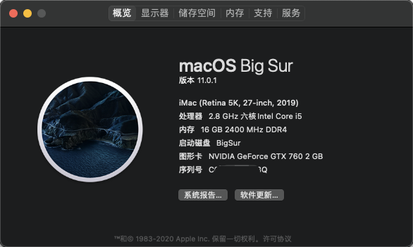
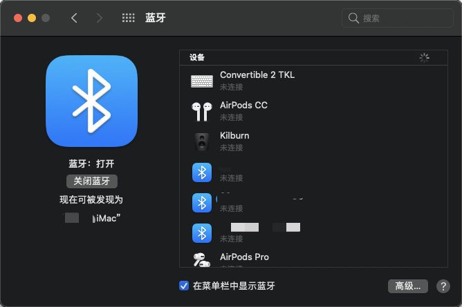

# 黑苹果 OpenCore
支持 macOS、Windows 双系统引导。

## 提示
- OpenCore Configurator 与 OC 版本均为 0.6.0 （保持版本一致，否则启动报错) 
- 某些 OC 配置可能导致 Windows 启动时提示自动修复或蓝屏，本 OC 可正常引导。

## 支持列表

- **macOS Big Sur**
- **macOS Catalina (未测试)**
- **macOS Mojave**

## BIOS设置
- **默认即可**

## 配置
| 名称         | 型号 |
| ----        | ---- |
| 处理器(CPU)  | 英特尔 Core i5-8400 @ 2.80GHz 六核 |
| 主  板      | 七彩虹 Battle Axe C.B360M-HD（B360 芯片组） |
| 内  存      | 16 GB ( 宇瞻 DDR4 2400MHz ) |
| 显  卡      | Nvidia GeForce GTX 760 ( 2 GB / Nvidia ) |
| 显示器      |  冠捷 AOC2702 Q27G2SG4B+ ( Q27G2SG4B+ ) |
| 硬  盘1     | 金士顿固态硬盘 250GB (MacOS)|
| 硬  盘2     | 金士顿固态硬盘 250GB (Windows)|
| 硬  盘3     | 希捷2T (存储) |
| 蓝  牙      | BCM943602CS  |

## 使用方式
1. 替换 OC
2. 使用 OC/OpenCore.efi 引导

## 关于本机

## 蓝牙

## 参考

OpenCore: <https://dortania.github.io/OpenCore-Install-Guide/>

黑果小兵: <https://blog.daliansky.net/>

独行秀才: <https://shuiyunxc.gitee.io/>

youngle316(GitHub): <https://github.com/youngle316/ASRock-Z370M-ITX-AC> (无法引导Windows)

